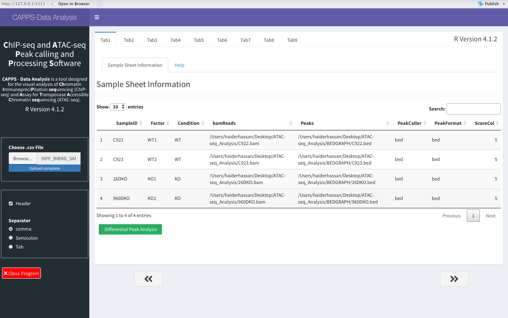
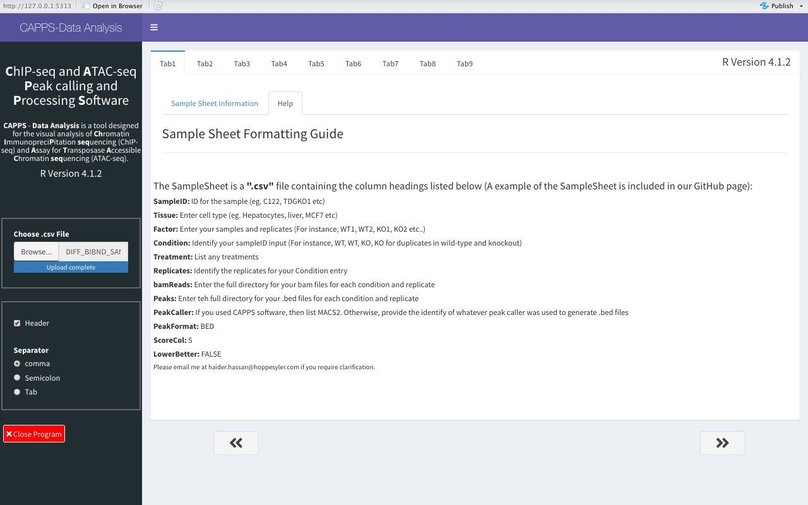
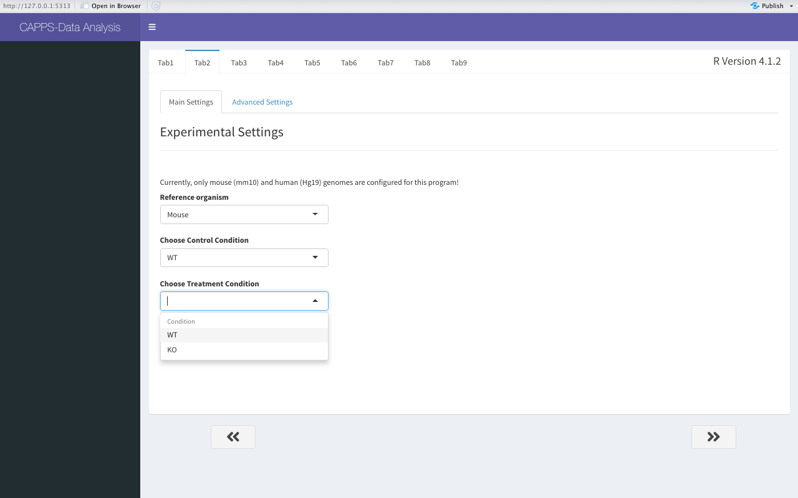
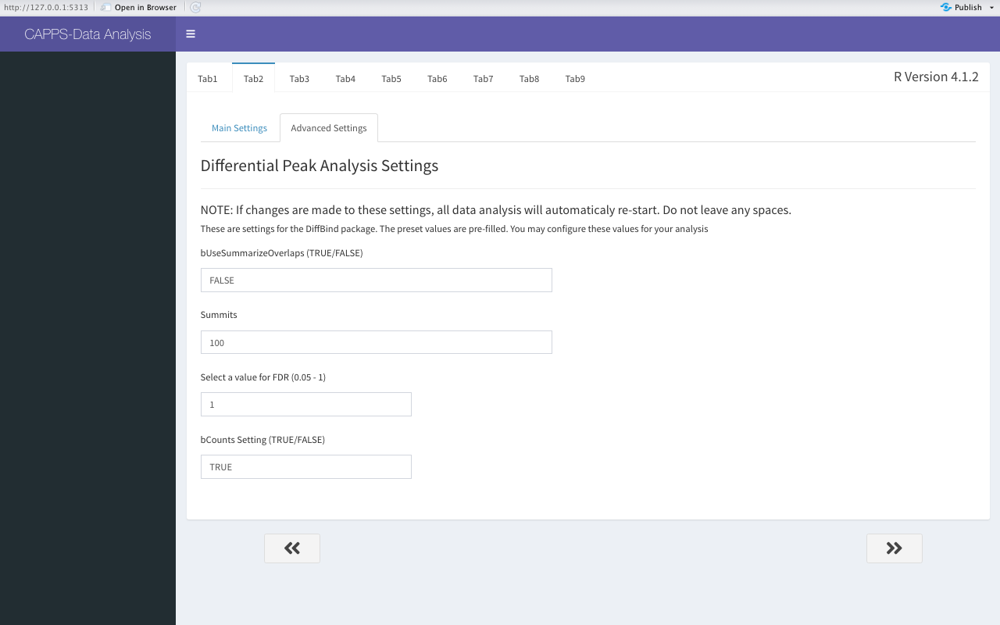
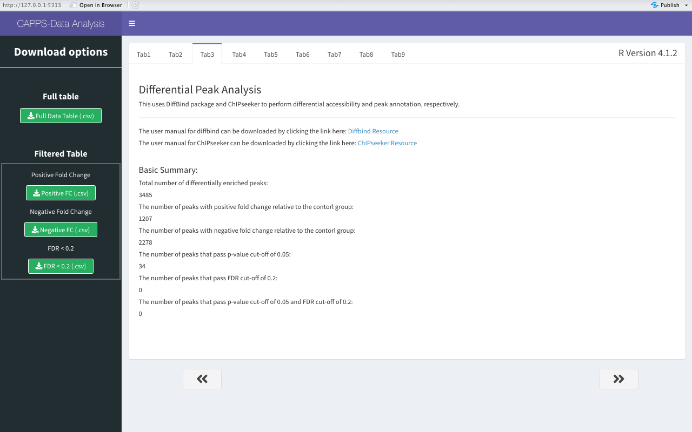
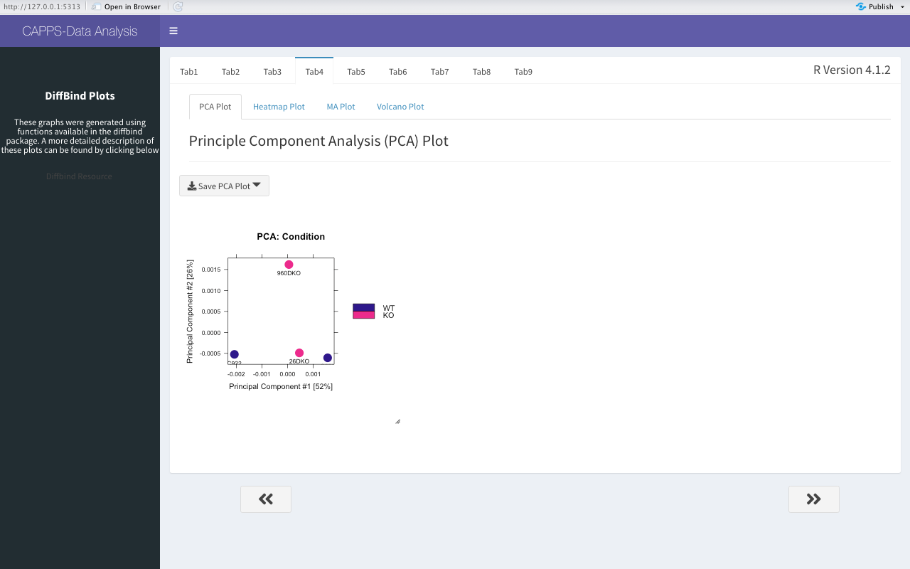

## **C**hIP-seq and **A**TAC-seq **A**nalysis **T**ool (CAAT)

This is a program for the analysis of ATAC-seq or ChIP-seq data in R. This package incorporates the following core packages for data analysis and visualization:
```
DiffBind
ChIPseeker
Clusterprofiler 
Ggplot2 
Pheatmap 
```
&nbsp;
&nbsp;
&nbsp;

## Table of Contents
1. [Installation](#installation-and-launching-shiny-dashboard)
2. [Sample Sheet Preparation](#sample-file-preparation)
3. [Steps to Data Analysis](#steps-to-data-analysis)
        1. [Load the Sample Sheet](#load-the-sample-sheet)
        2. [Experimental Settings](#experimental-settings)
        3. [Differential Peak Analysis](#differential-peak-analysis)
        4. [Sample Correlation Plots](#sample-correlation-plots)

&nbsp;
&nbsp;
&nbsp;

### **Installation and Launching Shiny Dashboard**
---------------------
The **app.R** can be downloaded and opened in R-studios. Please download the **_Required_Packages.R_** file and run it, which will attempt to automatically install the required packages. 

>  Ensure you have R version 4.1.2 or higher for compatibility. 

&nbsp;
&ensp;
&nbsp;
&ensp;

### **Run shiny dashboard through terminal**

1. Open Terminal and maneuver to the directory containing the `Required_Packages.R` and `app.R` files. Type the following command:

> R < Required_Packages.R --no-save


2. Wait for the installation of required packages to complete. Then type the following command in the terminal:

> Rscript -e 'library(methods); shiny::runApp("app.R", launch.browser = TRUE)'


3. This should launch the shiny dashboard app in the browser. 


**_A docker container will be available soon for easy installation and running of the software_**

&nbsp;
&ensp;
&nbsp;
&ensp;

### **Sample File Preparation**
---------------------

The sample file contains metadata on the following main items:

 1. Sample name and identification
 2. Condition (i.e. control sample and Sample with a treatment)
 3. Location of the binary assignment file (BAM)
 4. Location of the tab-delimted text file containing feature tracks
 
 **_A pre-filled sample file is included in the GitHub page for reference. Additionally, an empty template is also included in the page. _**
 
&nbsp;
&ensp;
&nbsp;
&ensp; 
 
### **Steps to Data Analysis**
---------------------
 **The following series of steps will outline the ways that CAPPS can be used for ChIP-seq or ATAC-seq data analysis.**

> Before using CAPPS, please ensure that you run the `Required_Packages.R` file which will attempt to install packages that may be missing. 

&nbsp;
&ensp;
&nbsp;
&ensp;

#### **Load the Sample Sheet**
---------------------

Click on the browse button to load the sample sheet. The sample sheet, once loaded, will be displayed beside the control panel.
The arrows at the bottom of the display box/panel allows easy maneuvering of the various tabs in the applicaiton. 

&nbsp;



&nbsp;

The **Help** tab contains extra information on preparation of the sample sheet. 



&nbsp;

**Please Note**
You can proceed directly to differential gene expression analysis if your reference genome is mouse. Otherwise go to **Tab2** or press the right arrow below the panel to proceed to next page. 

&nbsp;
&ensp;
&nbsp;
&ensp;

#### **Experimental Settings**
---------------------

This page allows the user to set main settings for the experiment. These entail selection of the reference genome, as well as control and treatment conditions. 



&nbsp;

The options in **_Advanced Settings_** tab are for manipulating settings for differential peak analysis. For further information on the advanced settings, please check out the [DiffBind resource](https://bioconductor.org/packages/devel/bioc/vignettes/DiffBind/inst/doc/DiffBind.pdf):




&nbsp;
&ensp;
&nbsp;
&ensp;


#### **Differential Peak Analysis**
---------------------

Maneuvering to this page initiates the differential peak analysis, peak annotation, and filtering. The output contains information on:
        - The number of differential enriched regions
        - The number of peaks with psitive and negative fold enrichment relative to the control sample
        - The number of peaks that meet p-value and FDR cutoffs. 
        


nsp;
&nbsp;
&ensp;

The control panel also contains options to download the full table, or a table that has been pre-filtered for positive or negative fold enrichment relative to the control samples. You can also download a table that has been adjusted to FDR < 0.2. 


&nbsp;
&ensp;
&nbsp;
&ensp;

#### **Sample Correlation Plots**
---------------------

This page contains some of the exploratory plots for sample correlation. These include the PCA, MA, heatmap and volcano plots. 




&nbsp;
&ensp;
&nbsp;
&ensp;


#### **Gene Annotation**
---------------------

